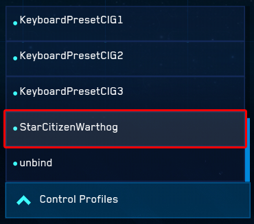

# starcitizen-warthog

An advanced [Star Citizen](https://robertsspaceindustries.com/about-the-game)
joystick profile and [T.A.R.G.E.T. script](http://www.thrustmaster.com/en_US/products/target)
for the [Thrustmaster HOTAS Warthog joystick](http://www.thrustmaster.com/en_US/products/hotas-warthog)
and [Cougar MFDs](http://www.thrustmaster.com/en_US/products/hotas-cougar).


## Joystick Layout

[View Joystick Layout](joystick_layout.svg)

[MFD Layout Inserts](Cougar-MFD-leaflet.pdf)


## Installation

1. [Download starcitizen-warthog](https://github.com/amclain/starcitizen-warthog/archive/master.zip)
to your computer.
1. Copy `layout_starcitizen_warthog.xml` to `StarCitizen\CitizenClient\USER\Controls\Mappings`.
1. Launch `TARGET Script Editor` and open `star_citizen.tmc`.
1. Run the TARGET script. It will take several seconds for the script to connect
the virtual devices. It will display `main returned 0` when complete.
1. Launch `StarCitizen` and go to `Options` -> `Keybinding` -> `Joystick` -> `Advanced`.
1. Select `StarCitizenWarthog` from the `Control Profiles` list.



## Special Functions

### Weapon Selection
The trim hat `H1x` functions as a selector for weapon groups 1 through 4. A
short tap selects the weapon to use on the trigger's first stage `TG1`, and a
long press selects the weapon to use on the trigger's second stage `TG2`. The
weapon assigned to `TG1` is shown on the LED's on the base of the throttle.

    H1U - Up    - Weapon 1
    H1D - Down  - Weapon 2
    H1L - Left  - Weapon 3
    H1R - Right - Weapon 4

The pinky switch on the throttle can be used to quickly swap the weapons on
`TG1` and `TG2` without having to reassign them. This is toggled by the pinky
switch's middle `PSM` and back `PSB` postions.

### Pin Target

A long press on TMS hat up `H2U` will pin the focused target. Pinned targets
can be cycled with TMS hat right `H2R`.

### Power Management

Setting the throttle `EAC ARM` switch enables the power management functions
on the DMS hat, `H3x`.

    H3U - Up    - Reset Power Balance
    H3D - Down  - Power Group 3
    H3L - Left  - Power Group 1
    H3R - Right - Power Group 2

### Strafing

Setting the boat switch forward `BSF` enables strafing on the coolie hat, `CSx`.

    CSU - Up    - Strafe Up
    CSD - Down  - Strafe Down
    CSL - Left  - Strafe Left
    CSR - Right - Strafe Right

### HUD Navigation

Setting the boat switch backward `BSB` enables HUD navigation on the CMS hat,
`H4x`.

    H4U - Up    - Navigate Up
    H4D - Down  - Navigate Down
    H4L - Left  - Navigate Left
    H4R - Right - Navigate Right
    H4P - Push  - Confirm


## Advanced

Console commands:

```text
pp_RebindKeys layout_starcitizen_warthog

Other commands:
i_DumpDeviceInformation
pp_ResortDevices
```
